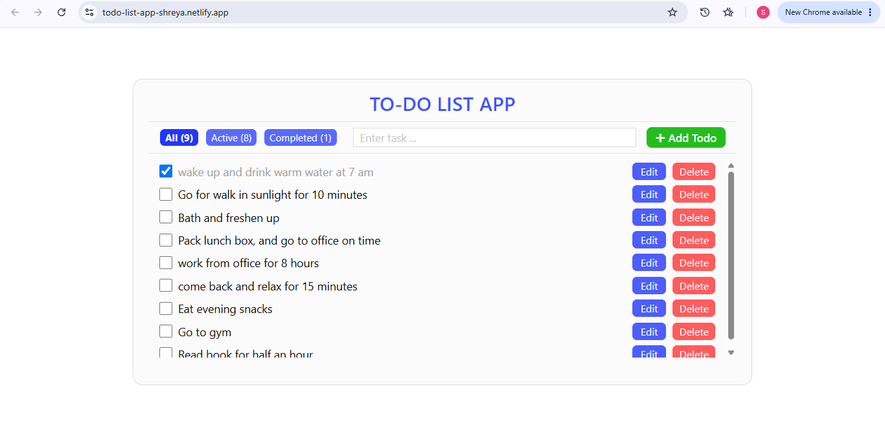

# 📝 Fully Responsive React To-Do Application

A production-grade, highly responsive task management application built from scratch to master React hooks, complex UI state synchronization, and localized data persistence.

This application moves beyond basic tutorial concepts by incorporating custom interactive elements, cross-device layout engineering, and graceful micro-interactions.

Live Link: https://todo-list-app-shreya.netlify.app/

---

  

---

## 🚀 Key Engineering Features

- **State-Driven Inline Editing:** Engineered a custom inline editing toggle within the task array mapping. Users can switch individual items between a text read-view and an active input field dynamically without jarring UI jumps or broken layouts.
- **Persistent Web API Integration:** Implemented an optimized automatic local storage synchronization loop via `useEffect`. The engine handles both active task items and empty arrays gracefully, maintaining accurate browser state persistence across user sessions.
- **Dynamic Filter Architecture & Derived State:** Optimized computation mechanics by calculating "All", "Active", and "Completed" task metrics on the fly from the core state array. This eliminates redundant state management trackers and protects the app from reconciliation bugs.
- **Pure React Micro-Interactions (Custom Toasts):** Built a race-condition protected toast notification engine using decoupled `useEffect` timers. When a task is added, updated, or deleted, a high-contrast popup visually alerts the user and cleanly auto-destructs after 3 seconds using strict layout timer cleanups.
- **Pixel-Perfect Responsive Layouts:** Styled natively using standard CSS Flexbox properties alongside modern CSS logical properties (`margin-inline-start`, `margin-inline-end`). Engineered advanced viewport adjustments to prevent button wrapping and staircase elements on highly narrow mobile viewports (like the Samsung Galaxy A51).

---

## 🛠️ Tech Stack & Methods

- **Frontend Library:** React.js (Functional Components & Hooks)
- **State Management:** `useState` (utilizing lazy state initialization for localStorage lookups)
- **Side Effects:** `useEffect` (for data persistence and animation cleanups)
- **Styling Architecture:** Modern Vanilla CSS (Flexbox, Media Queries, CSS Variables, and Logical Properties)

---

## 📱 Interface Design & Component Layout

### Desktop View

The desktop environment uses an open, centered `70vw` layout card, allowing long-form task items to display comfortably horizontally alongside high-contrast utility counters and action controls.

### Mobile View Optimization

When the viewport scales below `768px`, the application dynamically morphs:

- **The Top Control Bar** shifts from a strict horizontal line into a cleanly grouped vertical stack.
- **Task Row Items** execute a `flex-wrap: nowrap` rule with strict `flex-shrink: 0` constraints on action elements, guaranteeing that the Edit and Delete operations remain locked horizontally on the right side of the screen without text clipping.
- **Checked Tasks** receive a text-decoration strike-through and an opacity modifier, visually muting completed rows so active objectives stand out.

---

## 🧠 Version Control Milestones Conquered

This repository tracks real-world engineering problem-solving, successfully navigating deep Git architectures including:

1. **Unrelated Histories Resolutions:** Synchronized local build milestones with remotely initialized setups via `--allow-unrelated-histories`.
2. **Merge Conflict Management:** Safely resolved automated tracking file collisions using targeted checking parameters before main production deployments.
